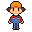
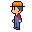
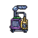
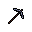

<!--Written by l0c, v1.0-->
<!--this is a model! copy this into the actual files and stuff-->
<!--Remember -> mkdocs may break in unexpected ways. Always check your links!-->

# Documentação do Protótipo

## 1. Visão Geral

Este artefato apresenta uma <b>demonstração em vídeo</b> que tem como propósito ilustrar a visão futura e o comportamento do sistema interativo do jogo "EcoGame" quando implementado em entregas futuras. O vídeo foca na apresentação das mecânicas: <b>coleta de itens</b> (resíduos), <b>gerenciamento de inventário</b> e <b>interação com o cenário</b> (elementos da flora e maquinários de reciclagem).

O projeto destaca-se pela identidade visual autoral, com artes feitas à mão pelos membros da equipe, abrangendo desde a vegetação até os itens de coleta (garrafas, resíduos orgânicos) e a estação de <i>crafting</i>. Esta demonstração serve como base visual para a validação do fluxo de jogo e da estética proposta.

## 2. Gravação (Demo em Vídeo) 

<iframe width="560" height="315" src="https://www.youtube.com/embed/sC0InVmMpRI" title="YouTube video player" frameborder="0" allow="accelerometer; autoplay; clipboard-write; encrypted-media; gyroscope; picture-in-picture; web-share" referrerpolicy="strict-origin-when-cross-origin" allowfullscreen></iframe>

---

## 3. Divisão de Responsabilidades

A equipe dividiu a criação dos componentes da seguinte forma:

| Membro | Responsabilidades |
| :----: | :-------------- |
| **Heyttor** | Desenvolvimento e comportamento do Protagonista  |
| **Yasmin** | Criação e assets das Plantas (árvores) e do sistema/objetos de Lixo |
| **Jose** | Design e implementação da Tela de Início do sistema |
| **João** | Desenvolvimento das Ferramentas, sistema de Inventário, modelo/interação da Casinha e organização/edição do video|

---

## 3. Assets do Jogo (Artes e GIFs)
As principais podem ser visualizadas a baixo:

- 

- 

- 

- 

- 

Todos os arquivos de arte, incluindo versões em alta resolução e arquivos editáveis do Piskel, podem ser encontrados na pasta oficial do projeto:
[Acesse a pasta de Assets no Google Drive](https://drive.google.com/drive/folders/10wTsYJrfEzYvvWGVWbdFuk2pp05w02Nz?usp=drive_link)

---

## 4. Extras

Para detalhes sobre o processo de construção, escolha de ferramentas e evolução das mecânicas durante a fase de ideação, consulte o <a href = "../../design-sprint/DIA-04/">Relatório do Dia 04 - Design Sprint</a>.

---

## Histórico de versão

| Versão |    Data    |          Descrição           |                      Autor                       | Revisor |
| :----: | :--------: | :--------------------------: | :----------------------------------------------: | :-----: |
|  1.0   | 03/04/2026 | Criação da documentação do protótipo | [Daniel Nunes Daurte](https://github.com/DanNunes777) |   [Yasmin Abdon](https://github.com/yaabdon)     |
|  2.0   | 05/04/2026 | Correção e Incremento de objetos pertinentes do protótipo | [Yasmin Abdon](https://github.com/yaabdon) |    |