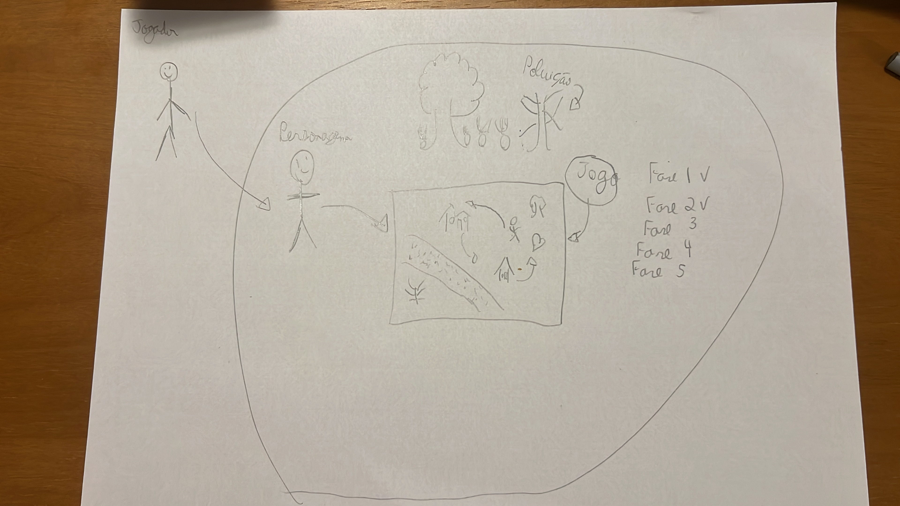
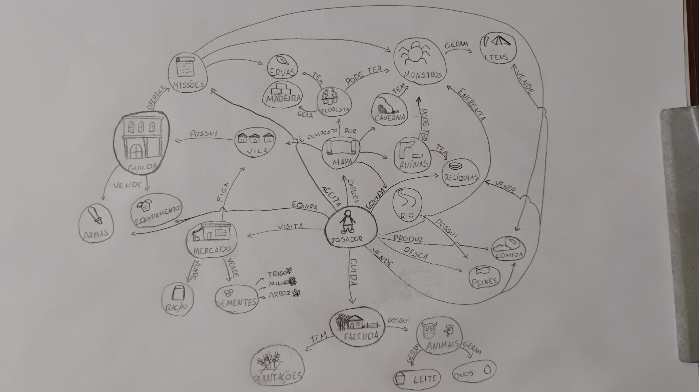
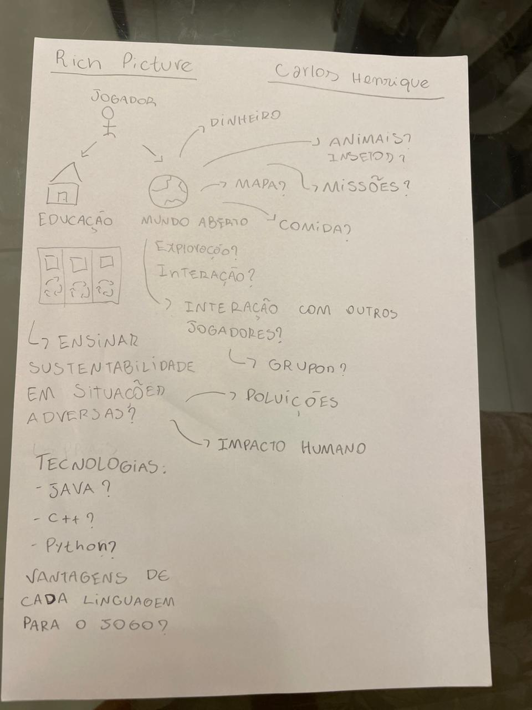
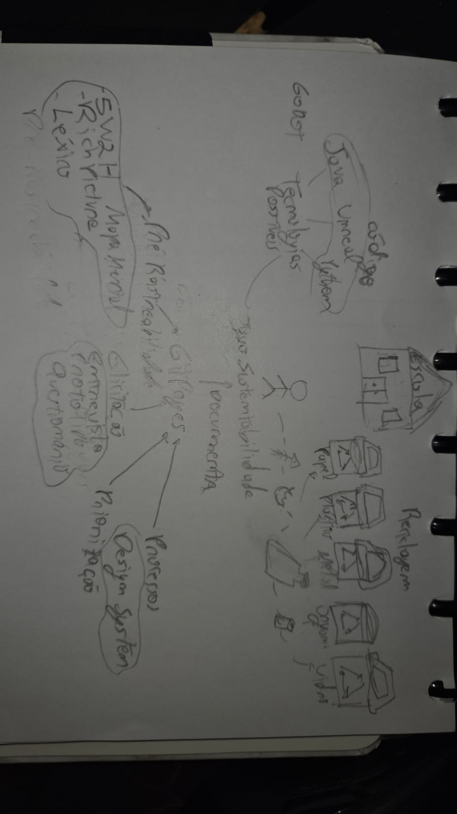
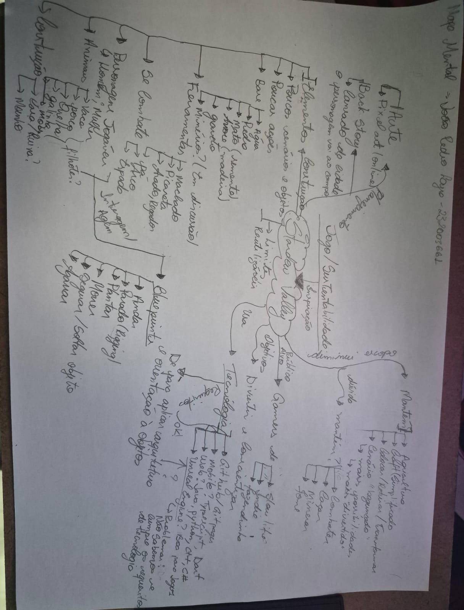
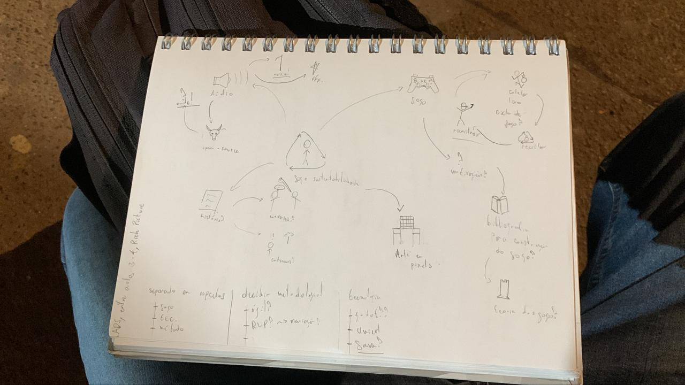
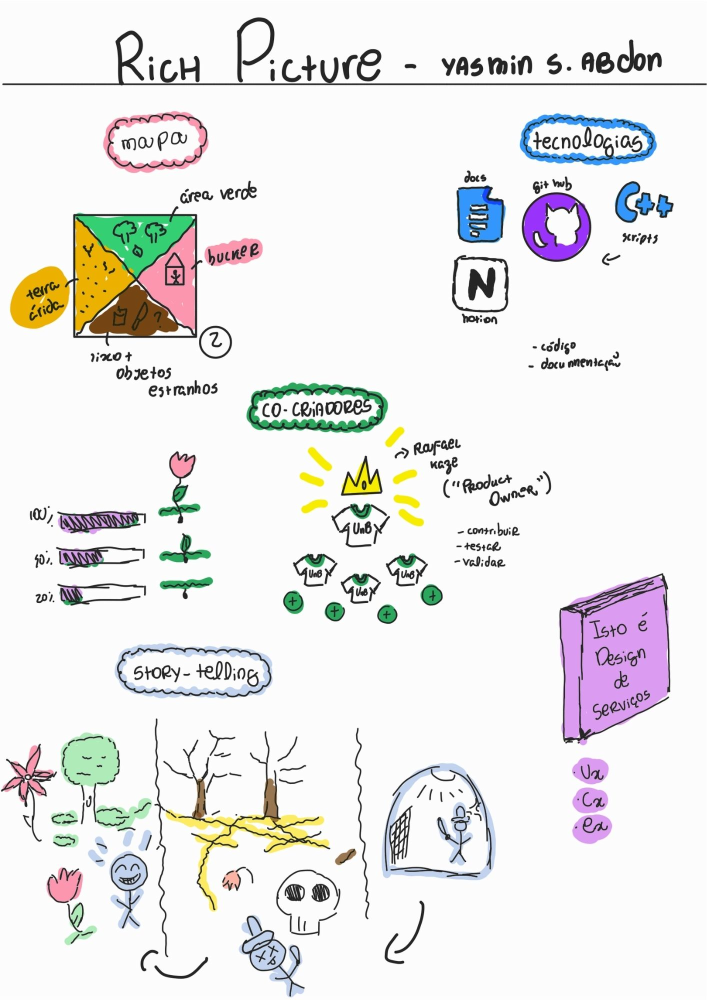

# Esboçar

## Introdução

Depois de um dia inteiro de compreensão do problema e de escolha de um alvo para o sprint, o segundo dia foca em buscar soluções. O dia começa com inspiração: uma revisão das ideias existentes para remixar e melhorar. Em seguida, cada pessoa esboça soluções seguindo um processo de quatro etapas que enfatiza o pensamento crítico sobre a arte.

## Metodologia

A etapa de Esboçar foi conduzida seguindo as atividades propostas pelo método Design Sprint da Google Ventures, adaptadas ao contexto do projeto G1_JogoSustentabilidade. As atividades foram realizadas de forma colaborativa, com a participação dos membros da equipe.

### Informações da Sessão

- **Data de Realização**: 24/03/2026
- **Horário de Início**: 20:30
- **Horário de Término**: 21:40
- **Duração**: 1 hora e 10 minutos
- **Participantes**: Carlos, Daniel, Guilherme, Heyttor, João, Matheus, Yasmin
- **Faltas**: Gabriel, José, Ryan

## Atividades Realizadas

### 1. Refazer mapa do fluxo do usuário

Revisão e refinamento do mapa do fluxo do usuário criado no dia anterior, garantindo que os caminhos identificados estejam claros e completos para embasar as soluções que serão esboçadas.

### 2. Lightning Demos

Os membros da equipe se revezam fazendo apresentações de 3 minutos sobre possíveis soluções já existentes para os alvos levantados no dia anterior, seguindo as orientações:

- Todos criam uma lista de produtos ou serviços em busca de soluções inspiradoras advindas de grandes companhias;
- As fontes de inspiração podem vir de todos os lugares, não se restringindo apenas ao contexto do projeto;
- Cada membro faz uma apresentação de 3 minutos;
- O facilitador coloca as grandes ideias no quadro, fazendo perguntas como: "Qual é a grande ideia aqui que pode ser útil?"

### 3. Agrupar a Equipe

Momento de reagrupar a equipe para alinhar as ideias e preparar as próximas atividades.

### 4. O Esboço em Quatro Etapas

Atividade principal do dia, dividida em quatro etapas:

- **Anotações**: A equipe caminha em silêncio pela sala e checa o quadro branco e demais artefatos, fazendo anotações. Essas anotações devem ser uma coletânea dos maiores "sucessos" das últimas 24 horas de Design Sprint;
- **Ideias**: Preenchimento de uma folha de papel com ideias de desenhos, títulos experimentais, diagramas e bonecos de palito representando uma ação. Essa folha não é compartilhada com a equipe, serve como rascunho;
- **Crazy 8s**: Cada membro recebe uma folha A4 dobrada em 8. Escolhe uma ideia e, em 8 minutos, faz 8 esboços diferentes sobre essa mesma ideia até não conseguir mais fazer variações, passando então para outra ideia circulada anteriormente;
- **Esboço da solução (Storyboard)**: Esboço autoexplicativo e anônimo, com uso de palavras e títulos marcantes.

## Artefatos Gerados

### Rich Picture - José Oliveira

### Rich Picture - Gabriel Mendes

### Rich Picture - Matheus

### Rich Picture - Carlos

### Rich Picture - Guilherme

### Rich Picture - Heyttor

### Mapa Mental - João

### Rich Picture - Ryan

### Rich Picture - Yasmin

## Referências

> KNAPP, Jake; ZERATSKY, John; KOWITZ, Braden. **Sprint: How to Solve Big Problems and Test New Ideas in Just Five Days**. Simon & Schuster, 2016.

> Google Ventures. **The Design Sprint**. Disponível em: [https://www.gv.com/sprint/](https://www.gv.com/sprint/). Acesso em: 29 mar. 2026.

## Histórico de versão

| Versão |    Data    |          Descrição           |                      Autor                       | Revisor |
| :----: | :--------: | :--------------------------: | :----------------------------------------------: | :-----: |
|  1.0   | 29/03/2026 | Criação da página            | [Gabriel Mendes](https://github.com/gbevi)       |         |
|  1.1  | 03/04/2026 | Adicionando meu rich picture             | [Yasmin Abdon](https://github.com/yaabdon)       |         |
|  1.3   | 04/04/2026 | Preenchimento das informações da sessão conforme Ata 2, ajustes e correções nos rich pictures, correção dos nomes dos autores e indicações sobre o uso de mapa mental | [Carlos](https://github.com/Depaiiva) e [João Pedro](https://github.com/jadequilin) |         |
