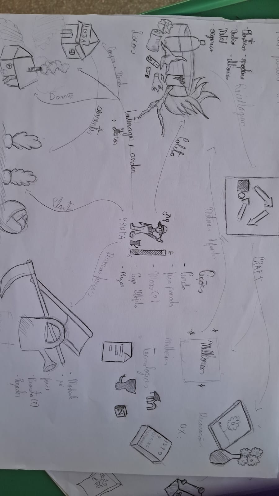

# Decidir

## Introdução

Com base nos vários esboços produzidos, o terceiro dia da Sprint é dedicado à tomada de decisão. Selecionamos a ideia que apresenta maior potencial para solucionar o problema definido.

<!-- 

By Wednesday morning, you and your team will have a stack of solutions. That’s great, but it’s also a problem. You can’t prototype and test them all—you need one solid plan. In the morning, you’ll critique each solution, and decide which ones have the best chance of achieving your long-term goal. Then, in the afternoon, you’ll take the winning scenes from your sketches and weave them into a storyboard: a step-by-step plan for your prototype.
Decision - Têm-se a seleção/escolha da melhor ideia - melhor RichPicture - e o desenho
de uma storyboarding, a qual guiará o desenvolvimento do protótipo.

 -->

## Metodologia

A etapa de Decidir foi conduzida seguindo as atividades propostas pelo método Design Sprint da Google Ventures, adaptadas ao contexto do projeto G1_JogoSustentabilidade. As atividades foram realizadas de forma colaborativa, com a participação dos membros da equipe.

### Informações da Sessão

- **Data de Realização**: 26/03
- **Horário de Início**: A definir
- **Horário de Término**: A definir
- **Duração**: A definir
- **Participantes**: A definir

## Atividades Realizadas

### 1. Reunião da Equipe

Os membros da equipe se reuniram para dar continuidade ao Design Sprint, com foco na análise e escolha das melhores soluções propostas no dia anterior.

### 2. Apresentação dos Rich Pictures

Cada integrante apresentou seu <i>rich picture</i>, explicando sua proposta de solução com base nos esboços desenvolvidos. As representações foram exibidas para toda a equipe, permitindo uma visão geral das diferentes abordagens sugeridas.

### 3. Análise Coletiva

Após as apresentações, os <i>rich pictures</i> foram analisados em conjunto, considerando aspectos como clareza da solução proposta, coerência com o problema definido e potencial de aplicação prática.

### 4. Discussão e Críticas

A equipe realizou um momento de discussão aberta, onde cada membro pôde compartilhar opiniões sobre as soluções apresentadas, destacando pontos fortes, sugerindo melhorias e levantando dúvidas ou possíveis limitações.

### 5. Votação

Ao final das discussões, foi realizada uma votação entre os membros da equipe para selecionar as soluções mais relevantes. Cada participante escolheu a proposta que considerou mais adequada para resolver o problema.

### 6. Escolha da Melhor Solução

Com base nos votos, a <i>rich picture</i> do Heyttor foi definida como a que melhor representa a solução a ser seguida. Essa decisão servirá como base para as próximas etapas do Design Sprint.

## Rich Picture Escolhida

### Rich Picture - Heyttor

## Referências

> KNAPP, Jake; ZERATSKY, John; KOWITZ, Braden. **Sprint: How to Solve Big Problems and Test New Ideas in Just Five Days**. Simon & Schuster, 2016.

> Google Ventures. **The Design Sprint**. Disponível em: [https://www.gv.com/sprint/](https://www.gv.com/sprint/). Acesso em: 29 mar. 2026.

## Histórico de versão

| Versão |    Data    |           Descrição            |                         Autor                          | Revisor |
| :----: | :--------: | :----------------------------: | :----------------------------------------------------: | :-----: |
|  1.0   | 29/03/2026 |       Criação da página        |       [Gabriel Mendes](https://github.com/gbevi)       |         |
|  2.0   | 30/03/2026 | Documentação do dia de decisão | [Guilherme Zanella](https://github.com/guilhermezan42) |         |
