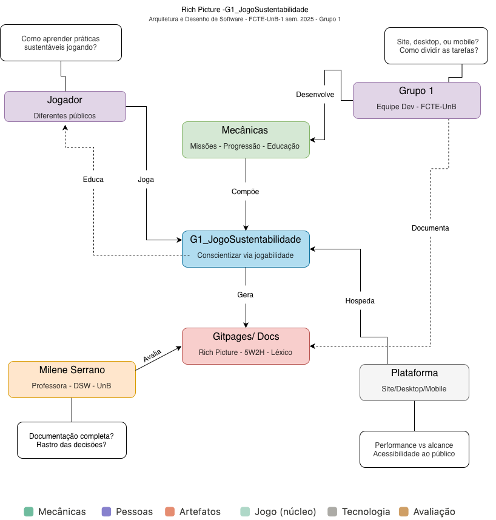

# _Rich Pictures_

## Introdução

  Um _Rich Picture_ é um artefato que utiliza especialmente desenhos para representar um cenário ou um problema. Não existe um modelo único ou “correto” para sua construção; entretanto um bom _Rich Picture_ deve ser capaz de comunicar ideias de forma clara. O mais comun é começar pelo centro da folha (ou da tela) e expandir gradualmente em direção às bordas, utilizando imagens e palavras‑chave. Mas é importante não sobrecarregar o _Rich Picture_ com muito texto, já que objetivo do deste artefato é apresentar uma ideia de maneira visual. ([RICH PICTURE GUIDELINES, [2012?]](#ref-2)).
  
  O _Rich Picture_ possui três elementos principais, como mostra Monk e Howard (1998): **Estrutura**, **Processo** e **Preocupações**.
  
  - A **Estrutura** inclui, dentre outros, as lugares, os equipamentos e, mais importante, as pessoas que vão usar ou que serão afetadas pelo novo sistema. São elas que o RICH PICTURE GUIDELINES define como "atores".
  
  - Os **Processos** representam o fluxo de dados ou informações entre os elementos do _Rich Picture_. São representados por uma seta, geralmente com uma descrição que a acompanha.
  
  - E as **Preocupações** são exatamente os sentimentos, dificuldades ou os problemas que os atores enfrentam. Podem ser representadas como um balão de pensamento e são os elementos mais úteis do _Rich Picture_.

  A **Figura 1** abaixo apresenta um exemplo de _Rich Picture_.

  

    
<strong>Figura 1 – Exemplo de <em>Rich Picture</em></strong>

  

  
  

  
  
  
  

  
  

      
Fonte: <a href="#ref-1">MONK; HOWARD, 1998</a>.

  

## Metodologia

  A metodologia adotada para a criação do _Rich Picture_ seguiu o modelo do [_Design Sprint_](), particulamente as atividades realizadas no segundo e terceiro dias (terça-feira e quarta-feira). Na terça‑feira, a equipe se reuniu para discutir a ideia geral do projeto e, ao final, decidiu que cada integrante ficaria responsável por elaborar individualmente um _Rich Picture_. Já na quarta‑feira, o grupo voltou a se reunir para apresentar as propostas e selecionar, de forma colaborativa, a melhor representação.

### O _Rich Picture_ escolhido

  A **Figura 2** abaixo apresenta o _Rich Picture_ escolhido na reunião.

  

    
<strong>Figura 2 – <em>Rich Picture</em> do Projeto</strong>

  

  
  

  
  
  
  

  
  

      
Autor(es): .

  

### Outros Rich Pictures produzidos

  Como mencionado anteriormente, cada integrante da equipe ficou responsável por produzir um _Rich Picture_. As figuras 3 a [X] abaixo apresentam esses _Rich Pictures_ que não foram selecionados.

  

    
<strong>Figura 3 – <em>Rich Picture</em> do Matheus</strong>

  

  
  

  
  
  
  

  
  

      
Autor(es): <a href="https://github.com/MatheusHenrickSantos">Matheus Henrick</a>.

  

  ---

  

    
<strong>Figura X – <em>Rich Picture</em> do _</strong>

  

  
  

  
  
  
  

  
  

      
Autor(es): .

  

<!-- Essa parte deverá ser movida para outro documento ainda a definir
## Rich Picture 1

Ferramenta utilizada: draw.io | Autor: Jose Oliveira | Data: 24/03/2025
-->

## Bibliografia

  > MONK, Andrew; HOWARD, Steve. **The Rich Picture: A Tool for Reasoning About Work Context**. Interactions, [S. l.], v. 5, n. 2, p. 21-30, mar./abr. 1998.
  >
  > DE MONTFORT UNIVERSITY. CTEC2402 - Software Development Project: Introducing Rich Pictures - Rich Picture Drawing Guidelines. Leicester: DMU, [2012?]. 1 arquivo (8 p.). PDF.

## Histórico de Versões

| Versão | Data | Descrição | Autor(es) | Revisor(es) |
| :----: | :--: | :-------: | :-------: | :---------: |
| `1.0`  | 24/03/2026 | Adição do rich picture 1 | [Jose Oliveira](https://github.com/jose1277) | [Matheus Henrick](https://github.com/MatheusHenrickSantos) |
| `1.1`  | 28/03/2026 | Adiciona os tópicos Introdução e Metodologia | [Matheus Henrick](https://github.com/MatheusHenrickSantos) |  |